<div align="center">



<br/><br/>


<br/>

<a href="https://linkedin.com/in/zareshahi"></a>
<a href="mailto:a.zareshahi1377@gmail.com"></a>


</div>

---

## 🧠 About Me

```python
class AliZareshahi:
    role       = "AI Developer"
    focus      = ["RAG pipelines", "AI Agents", "LLM fine-tuning", "Persian NLP"]
    degree     = "M.Sc. Artificial Intelligence & Robotics"
    experience = "4+ years"
    now        = "building retrieval systems for large-scale religious text corpora"
```

- 🔭 Working on **semantic search & RAG platforms** for specialized text domains
- 🤖 Building **AI agents** that call real-world services (GeoServer WPS, spatial computation)
- 🎯 Fine-tuning **BERT / Whisper** and deploying NLP models as **FastAPI microservices**
- 🗺️ Background in **geospatial web platforms** (OpenLayers, Angular)
- 📄 Author of *“Measuring Semantic Similarity of Persian Sentences Using ParsBERT”*

---

## 🛠️ Tech Stack

<div align="center">

**Languages & Frameworks**

     

**AI / ML**

    

**Data & Search**

   

**DevOps & Tools**

   

</div>

---

## 📊 GitHub Stats

<div align="center">


<br/><br/>


</div>

---

## 🚀 Featured Work

| Project | Description |
|---|---|
| 🕌 [**ai.inoor.ir**](https://ai.inoor.ir/) | Semantic similarity lab & AI search for religious (Hadith) texts |
| 🤖 [**aiparsa.ir**](https://aiparsa.ir/) | Parsa — RAG platform with semantic chunking & LLM propositioning |
| 🗺️ [**geotajak.ir**](https://geotajak.ir/) | Web-based geospatial data management platform |

---

## 🐍 Contributions

<div align="center">


</div>

---

<div align="center">


**⭐ If you find my work interesting, let's connect on [LinkedIn](https://linkedin.com/in/zareshahi)!**

</div>
